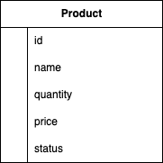

# TDD Project

## O que é TDD?
TDD é uma sigla para `Test Driven Development`, ou Desenvolvimento Orientado a Testes. A ideia do TDD é que você trabalhe em ciclos.

## Certificado de Conclusão


### Ciclo do TDD


### Vantagens do TDD
- entregar software de qualidade;
- testar procurando possíveis falhas;
- criar testes de integração, testes isolados (unitários);
- evitar escrever códigos complexos ou que não sigam os pré-requisitos necessários;

A proposta do TDD é que você codifique antes mesmo do código existir, isso nos garante mais qualidade no nosso projeto. Além de que, provavelmente se você deixar pra fazer os testes no final, pode acabar não fazendo. Com isso, sua aplicação perde qualidade e está muito mais propensa a erros.

# Store API
## Resumo do projeto
Este documento traz informações do desenvolvimento de uma API em FastAPI a partir do TDD.

## Objetivo
Essa aplicação tem como objetivo principal trazer conhecimentos sobre o TDD, na prática, desenvolvendo uma API com o Framework Python, FastAPI. Utilizando o banco de dados MongoDB, para validações o Pydantic, para os testes Pytest e entre outras bibliotecas.

## O que é?
Uma aplicação que:
- tem fins educativos;
- permite o aprendizado prático sobre TDD com FastAPI + Pytest;

## O que não é?
Uma aplicação que:
- se comunica com apps externas;


## Solução Proposta
Desenvolvimento de uma aplicação simples a partir do TDD, que permite entender como criar tests com o `pytest`. Construindo testes de Schemas, Usecases e Controllers (teste de integração).

### Arquitetura
||
|:--:|
| Diagrama de C4 da Store API |

### Banco de dados - MongoDB
||
|:--:|
| Database - Store API |


## StoreAPI
### Diagramas de sequência para o módulo de Produtos
#### Diagrama de criação de produto


#### Diagrama de listagem de produtos


#### Diagrama de detalhamento de um produto


#### Diagrama de atualização de produto


#### Diagrama de exclusão de produto


## Desafio Final

### ✅ Implementações Concluídas

#### **Create - Tratamento de Exceções de Inserção**

- ✅ Mapeamento da exceção `InsertionException` para erros de inserção
- ✅ Captura de `DuplicateKeyError` e `PyMongoError` no usecase
- ✅ Controller retorna status `400 Bad Request` com mensagem amigável
- ✅ Mensagens personalizadas: "Já existe um produto com esse identificador"

#### **Update - Not Found e Timestamp Automático**

- ✅ Método PATCH retorna exceção `NotFoundException` quando produto não encontrado
- ✅ Controller trata a exceção retornando `404 Not Found` com mensagem amigável
- ✅ Campo `updated_at` é automaticamente atualizado para o horário atual
- ✅ Permite modificar `updated_at` manualmente via payload
- ✅ Mensagem personalizada: "Produto não encontrado para atualização"

#### **Filtros - Busca por Faixa de Preço**

- ✅ Endpoint `GET /products/` aceita query parameters `min_price` e `max_price`
- ✅ Implementação do filtro MongoDB: `{"price": {"$gt": min_price, "$lt": max_price}}`
- ✅ Script de exemplo para cadastrar produtos com preços diferentes
- ✅ Suporte para filtros combinados e individuais

### **Exemplos de Uso**

#### **Filtrar produtos por preço (5000 < preço < 8000):**

```bash
GET /products/?min_price=5000&max_price=8000
```

#### **Criar produto com tratamento de erro:**

```json
POST /products/
{
  "name": "iPhone 15",
  "quantity": 10,
  "price": 7500.00,
  "status": true
}

# Resposta em caso de duplicidade:
# Status: 400 Bad Request
# {"detail": "Já existe um produto com esse identificador."}
```

#### **Atualizar produto (updated_at automático):**

```json
PATCH /products/{id}
{
  "quantity": 15,
  "price": 6500.00
}

# O campo updated_at será automaticamente definido como datetime.utcnow()
```

#### **Atualizar produto (updated_at manual):**

```json
PATCH /products/{id}
{
  "quantity": 15,
  "updated_at": "2025-08-05T10:30:00Z"
}
```

#### **Resposta de produto não encontrado:**

```json
PATCH /products/inexistente-id
# Status: 404 Not Found
# {"detail": "Produto não encontrado para atualização: inexistente-id"}
```

### **Script de Teste - Cadastro de Produtos**

Para testar os filtros, execute o script que cadastra produtos com preços variados:

```bash
python examples/seed_products.py
```

**Produtos cadastrados:**

- iPhone 13: R$ 4.500,00
- iPhone 14: R$ 6.000,00 ✅ (filtro 5000-8000)
- iPhone 15: R$ 7.500,00 ✅ (filtro 5000-8000)
- MacBook Air: R$ 8.500,00
- iPad Pro: R$ 3.000,00
- Apple Watch: R$ 2.500,00

### **Testes Implementados**

```python
# Teste de filtro por preço
async def test_usecases_query_with_price_filter_should_return_success()

# Teste de atualização automática de timestamp
async def test_usecases_update_should_update_timestamp()

# Teste de Not Found no update
async def test_usecases_update_should_not_found()
```

### **Estrutura de Exceções**

```python
# Novas exceções adicionadas:
class InsertionException(BaseException):
    message = "Error inserting data"
    
# Utilizadas nos endpoints:
- POST /products/ → InsertionException → 400 Bad Request
- PATCH /products/{id} → NotFoundException → 404 Not Found
- DELETE /products/{id} → NotFoundException → 404 Not Found
```

## Preparar ambiente

Vamos utilizar Pyenv + Poetry, link de como preparar o ambiente abaixo:

[poetry-documentation](https://github.com/nayannanara/poetry-documentation/blob/master/poetry-documentation.md)

## Links uteis de documentação

[mermaid](https://mermaid.js.org/)

[pydantic](https://docs.pydantic.dev/dev/)

[validatores-pydantic](https://docs.pydantic.dev/latest/concepts/validators/)

[model-serializer](https://docs.pydantic.dev/dev/api/functional_serializers/#pydantic.functional_serializers.model_serializer)

[mongo-motor](https://motor.readthedocs.io/en/stable/)

[pytest](https://docs.pytest.org/en/7.4.x/)
